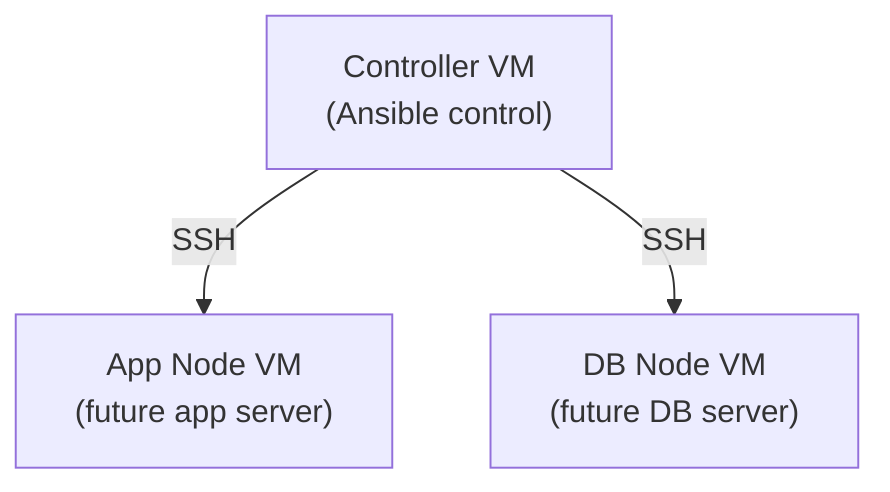

# Creating My Ansible Controller, App Node & DB Node with Terraform

[Creating My Ansible Controller, App Node & DB Node with Terraform](#creating-my-ansible-controller-app-node--db-node-with-terraform)
- [Creating My Ansible Controller, App Node \& DB Node with Terraform](#creating-my-ansible-controller-app-node--db-node-with-terraform)
  - [Overview](#overview)
  - [Problem We’re Solving](#problem-were-solving)
  - [1. Part One: Controller Deployment *seen here*](#1-part-one-controller-deployment-seen-here)
  - [2. Part Two: App Node Deployment *seen here*](#2-part-two-app-node-deployment-seen-here)
  - [3. Part Three: DB Node Deployment *seen here*](#3-part-three-db-node-deployment-seen-here)
  - [Key Takeaways](#key-takeaways)
  - [Why \& Benefits of Splitting into Controller, App \& DB Nodes](#why--benefits-of-splitting-into-controller-app--db-nodes)
    - [Why We Do It](#why-we-do-it)
    - [Benefits for Me](#benefits-for-me)
    - [Benefits for the Home Office](#benefits-for-the-home-office)
  - [Diagram](#diagram)
  - [Troubleshooting](#troubleshooting)
  - [Websites Used](#websites-used)

## Overview
This README explains:
- How I used **Terraform** to provision three separate VMs on AWS in preparation for using Ansible:  
  - A **controller VM** (Ansible control node).  
  - An **app-node VM** (future application server).  
  - A **db-node VM** (future database server).  
- Why splitting into these roles matters, the problem it solves, and the benefits it brings.  

## Problem We’re Solving
If everything is run on one machine, it’s difficult to manage and scale:  
- Controller, app, and database logic all overlap.  
- Harder to troubleshoot and isolate issues.  
- No dedicated “control” environment for automation.  

By creating **three separate VMs with Terraform**:  
- Each VM has a clear purpose (controller vs app vs DB).  
- The setup mirrors how Ansible will manage real-world environments.  
- Testing is easier because each machine can be verified individually.  
- We’re ready to move into the Ansible automation topic.  

## 1. Part One: Controller Deployment [*seen here*](controller)
- Created a VM named: `tech511-lauren-ubuntu-2204-ansible-controller`.  
- Used **Ubuntu 22.04 LTS (free tier eligible)**.  
- Instance type: **t3.micro**.  
- Security group: **SSH allowed**.  
- Network: default VPC + default subnets.  
- Key pair: reused my existing AWS key pair.  
- Public IP: **enabled**.  
- User data: **left blank** (no scripts yet).  
- Verified: could **SSH into the controller** after Terraform deployed it. 
   

 
**Why:** The controller is the central machine that will later manage automation for all nodes.  

## 2. Part Two: App Node Deployment [*seen here*](app-node)
- Created a VM named: `tech511-lauren-ubuntu-2204-ansible-target-node-app`.  
- Used **Ubuntu 22.04 LTS (free tier eligible)**.  
- Instance type: **t3.micro**.  
- Security group: allowed **SSH, HTTP, port 3000** (for app traffic).  
- Network: default VPC + default subnets.  
- Key pair: same as controller.  
- Public IP: **enabled**.  
- User data: **left blank** (no scripts yet).  
- Verified: could **SSH into the app node** after deployment.  

 

**Why:** The app node will host the application logic when Ansible configures it later.  

## 3. Part Three: DB Node Deployment [*seen here*](db-node)
- Created a VM named: `tech511-lauren-ubuntu-2204-ansible-target-node-db`.  
- Used **Ubuntu 22.04 LTS (free tier eligible)**.  
- Instance type: **t3.micro**.  
- Security group: allowed **SSH + MongoDB traffic** (for DB use).  
- Network: default VPC + default subnets.  
- Key pair: same as controller.  
- Public IP: **enabled**.  
- User data: **left blank**.  
- Verified: could **SSH into the DB node** after deployment.  
  

 

**Why:** The DB node will store and manage data securely once configured.  

## Key Takeaways
- Terraform can create the **infrastructure foundation** for Ansible.  
- Separating into **controller, app-node, and db-node** mirrors real-world DevOps practices.  
- Using the **same key pair** simplifies management across nodes.  
- Verifying SSH access ensures readiness for Ansible automation.  
- Keeping **user data blank** means Ansible will handle setup later.  

## Why & Benefits of Splitting into Controller, App & DB Nodes

### Why We Do It
- To keep roles separate (controller = automation, app = application logic, db = data).  
- To make automation and scaling easier later.  
- To prepare clean environments for Ansible configuration.  

### Benefits for Me
- Clear understanding of how controller vs nodes work.  
- Practice setting up **multiple instances** with Terraform.  
- Built confidence using default VPCs and subnets.  
- Got hands-on experience verifying SSH access across machines.  

### Benefits for the Home Office
- **Clarity of roles**: automation, app, and DB separated.  
- **Security**: database ports restricted to only what’s needed.  
- **Scalability**: app tier can scale independently in future.  
- **Foundation for automation**: controller ready to configure all nodes with Ansible.  

## Diagram

## Troubleshooting

## Websites Used

https://developer.hashicorp.com/terraform/tutorials/aws-get-started/aws-create

https://registry.terraform.io/providers/hashicorp/aws/latest/docs/resources/instance